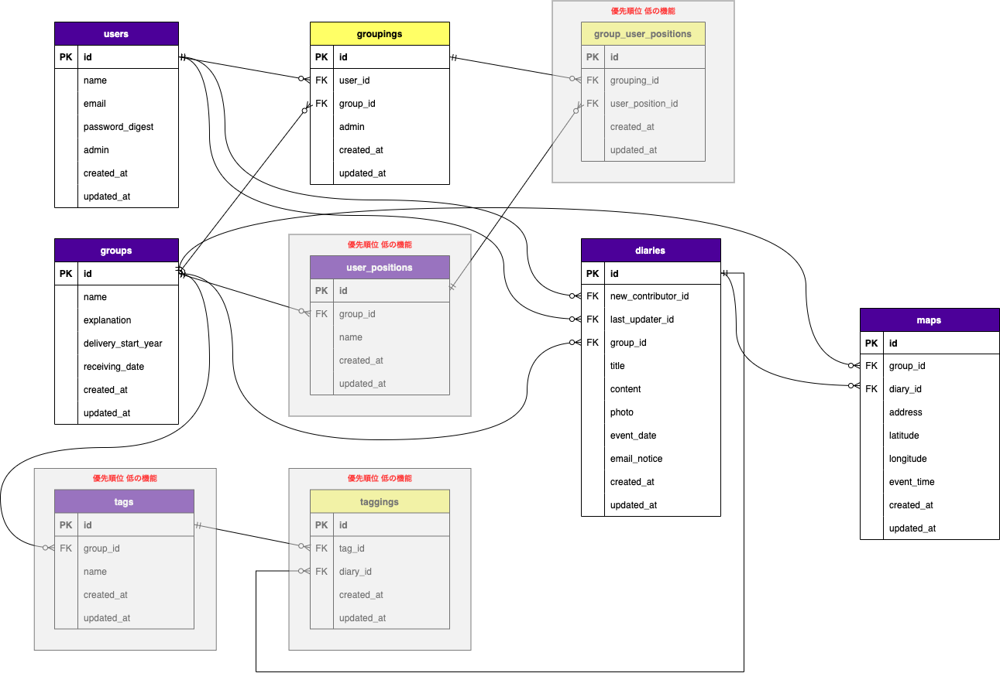

## アプリケーションURL
http://35.78.10.205
## このアプリケーションを開発した背景
家族で季節イベント（花見・紅葉・イルミネーション）や、不定期イベント（滝・ダム・山にハイキング・旅行）など、多くのお出かけ（イベント）をしてきました。そういったイベントを多く重ねた結果、この時期はどんなイベントがあったっけ？、どこに行ってたっけ？という事が増えてきました。そういった経験から、イベント事の管理・通知ができるアプリがあったら良いな、という想いでこのアプリを開発しました。

## このアプリケーションはどのように問題を解決するのか？
### グループ機能
グループ機能で、家族・友人間など仲間でグループ組を行います。
### 日記機能
日記機能によりグループ内で日記を投稿し、メンバー同士で共有を行う事ができます。イベント先をGoogle Mapsで登録する事ができ、過去にどこに出かけたか分かり易いようになっています。
### 自動通知（配信）機能
自動通知（配信）機能により、過去の日記をグループメンバーに配信します。そうする事により、
- 過去のイベント事を忘れずに済む。
- 日記やスケジュールアプリを振り返らなくても良い。
- 新しい思い出作りを促してくれる。  
のようにして問題を解決してくれます。

## このアプリケーションの概要
今までに行ったイベント事を記録し、翌年以降の同月数ヶ月前（1〜3ヶ月前）に
「yyyy年mm月はこういうイベントを行っていたよ！」と通知をしてくれるアプリです。

グループ機能を利用し、家族・友人間で日記を共有する事ができます。通知（配信）機能を使用する事により、グループのメンバーに過去の日記（イベント）を毎月配信する事が可能です。配信されたメールが、家族・友人間の思い出を蘇られせてくれると共に、新しい思い出作りも促してくれます。 

メール自動配信は、毎月最終金曜日夜7:00〜行われます。gemのwheneverでrakeタスクを実行し、メールを配信しています。  

配信設定画面で取得できる過去の日記（最大100年前）の範囲と、通知のタイミング（1〜3ヶ月前）を選ぶ事が可能です。

( 具体例 )  
2020年11月に家族で〇〇県に紅葉に行った事を日記投稿する...。  
その翌年2021年10月（11月の1ヶ月前）に、
- 2020年11月に〇〇県に紅葉に行った事  
を、家族に通知してくれる。  
 
さらに、家族で2021年11月に△△県に紅葉に行った事を日記投稿する...。  
その翌年2022年10月（11月の1ヶ月前）には、
- 2020年11月に〇〇県に紅葉に行った事  
- 2021年11月に△△県に紅葉に行った事  
を、家族に通知してくれる。

## 開発環境
- macOS Monterey 12.1
- Ruby 3.0.1
- Rails 6.0.4.4

## 使用Gem
- devise
- devise-i18n
- rails_admin
- cancancan
- carrierwave
- mini_magick
- geocoder
- dotenv-rails
- gon
- whenever
- enum_help
- seed-fu
- letter_opener_web
- fog-aws
- unicorn
- capistrano

## 就職Termの技術
- devise
- AWS EC2

## カリキュラム外の技術
- gmaps4rails
- geocoder

## 実行手順
```
$ git clone git@github.com:DaisukeKurita/re_timeline.git 
$ cd re_timeline
$ bundle install
$ rails db:create db:migrate
$ rails db:seed
$ rails s
```

## カタログ設計
[Re: Timeline カタログ](https://docs.google.com/spreadsheets/d/1034FTJepzzHVKPnQRCDIwXYPs29RevnoyInUAZenDnE/edit#gid=782464957)

## テーブル定義書
[Re: Timeline テーブル定義書](https://docs.google.com/spreadsheets/d/1034FTJepzzHVKPnQRCDIwXYPs29RevnoyInUAZenDnE/edit#gid=2020033787)

## ワイヤーフレーム
  

## ER図
  

## 画面遷移図
  


