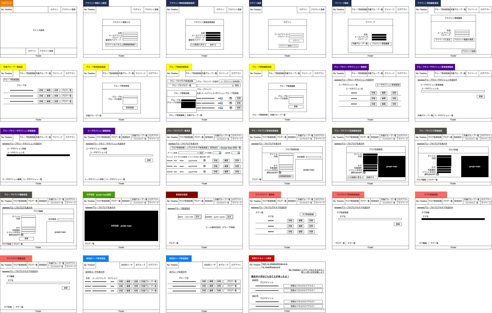
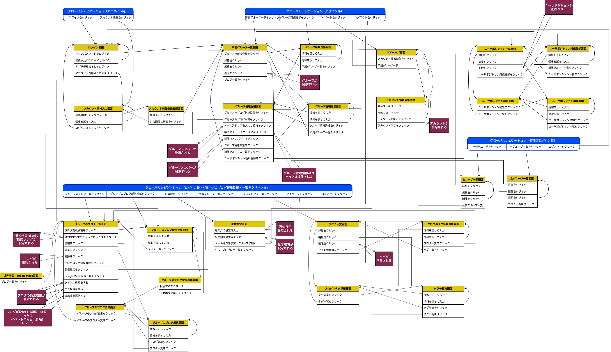

# README
## 開発言語
- Ruby 3.0.1
- Rails 6.0.4.4
## 就職Termの技術
- devise
- AWS
## カリキュラム外の技術
- Google Maps API
## 実行手順
```
$ git clone git@github.com:DaisukeKurita/re_timeline.git 
$ cd re_timeline
$ bundle install
$ rails db:create db:migrate
$ rails db:seed
$ rails s
```
## カタログ設計
[Re: Timeline カタログ](https://docs.google.com/spreadsheets/d/1034FTJepzzHVKPnQRCDIwXYPs29RevnoyInUAZenDnE/edit#gid=782464957)
## テーブル定義書
[Re: Timeline テーブル定義書](https://docs.google.com/spreadsheets/d/1034FTJepzzHVKPnQRCDIwXYPs29RevnoyInUAZenDnE/edit#gid=2020033787)
## ワイヤーフレーム
  
## ER図
  
## 画面遷移図
  